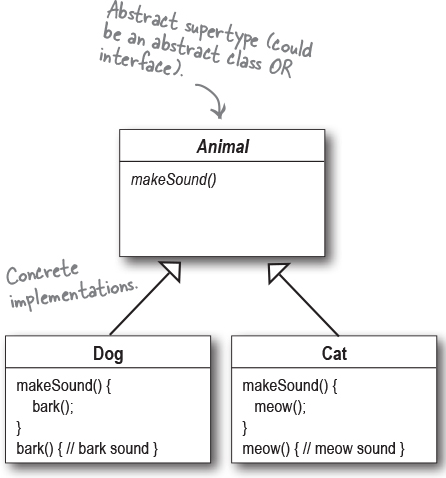

# Design Principles

## 1 Seperate things that change

Identify the aspects of your application that vary and seperate them from
what stays the same.

Parts that change shouldn't require work in parts that stay the same.
Also means when a change is needed only a minimal part of the code should require
adjustments!

## 2 Program to an interface, not an implementation

Imagine building a machine. Instead of hard-coding specific actions, define general abilities like "operate" or "connect."
Create separate modules for different ways to perform those abilities, like "pumping" or "wireless linking."
Now, you can easily swap modules to change the machine's behavior without rewriting its core code.
This makes it flexible, adaptable, and easier to build new machines with similar abilities.

## 3 Favor Composition over Inheritance

Build with building blocks, not family trees. Think Lego, not tangled family lineages.
Instead of inheriting everything from one ancestor, compose your objects from independent "behaviors"
like flying, quacking, or swimming. These mix and match like modular parts,
letting you create diverse ducks (swimmers, squeakers, rocket flyers!) without rewriting core duck code.
Changes in one behavior stay isolated, keeping your code clean and adaptable.
